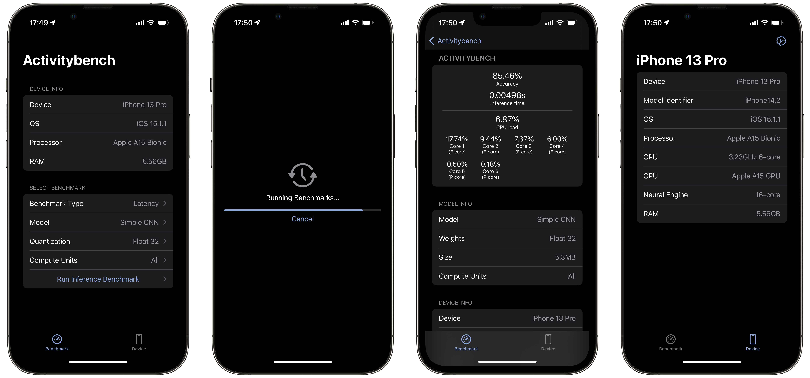
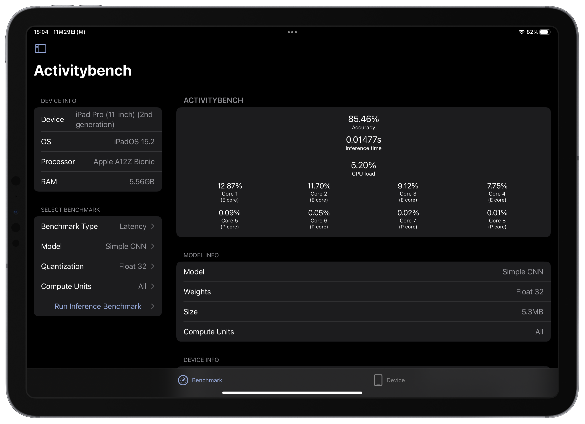

# Activitybench 3

Activitybench is an app for benchmarking activity recogntion CNN models, measureing accuracy, latency, etc. on the Apple devices.

This app measures accuracy, latency, battery consumption.

### iPhone

### iPad

## Usage

Just setect a model, press **Run**, and wait a hour to measure the benchmark!

## Requirements
- Xcode 12.0+
- macOS 11.0+
- iOS 14.0+

## Swift Package Dependencies
- [DeviceHardware](https://github.com/Shakshi3104/DeviceHardware)
- [FirebaseFirestore](https://github.com/firebase/firebase-ios-sdk)
